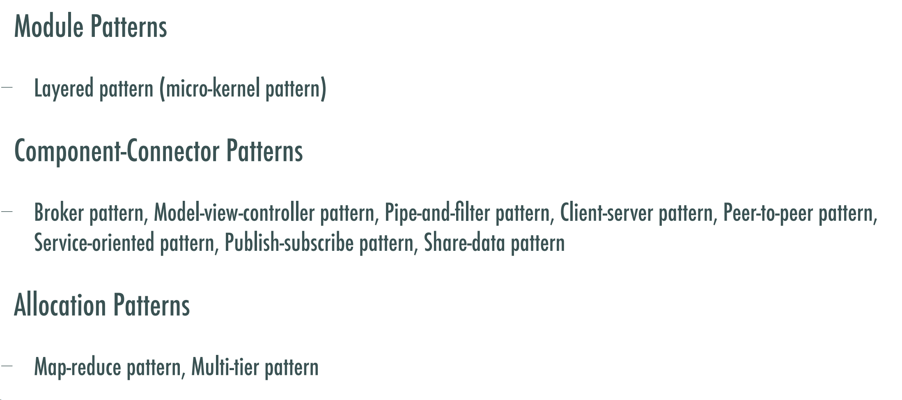

# 适合研究生宝宝的体系结构复习提纲

免责声明：自用 && 等着给一位要来的可爱的学弟

附录一：quality  attribute 对应的tactic

涉及到的质量属性：以ppt图为准

https://github.com/exlaw/Notes/blob/master/Software-Architecture/2.%20quality_attribute.md

https://github.com/Software-Knowledge/2021-Software-System-Design/blob/main/Lec13-Quality%20Attributes.md

附录二：Architecture  pattern

https://github.com/Software-Knowledge/2021-Software-System-Design/blob/main/Lec14-Architectural%20Pattern.md

附录三： ADD 每一个步骤 输入输出

https://github.com/Software-Knowledge/2021-Software-System-Design/blob/main/Lec15-Design.md
https://github.com/SpriCoder/SpriCoder-Notes/blob/main/2021-Software-System-Design/Exam1-ADD.md

这个是三个都有的：

https://github.com/SpriCoder/SpriCoder-Notes/blob/main/2021-Software-System-Design/%E8%BD%AF%E4%BB%B6%E7%B3%BB%E7%BB%9F%E8%AE%BE%E8%AE%A1-%E7%B3%BB%E7%BB%9F%E6%9E%B6%E6%9E%84%EF%BC%88%E7%AE%80%EF%BC%89.pdf

往年考题：已有整理

中文版描述：https://github.com/SpriCoder/SpriCoder-Notes/blob/main/2021-Software-System-Design/Exam0-%E5%BE%80%E5%B9%B4%E8%80%83%E8%AF%95.md

就不放license了，若提到的仓库有侵权删

~~修正了ppt的图和第二次课堂原话记录~~

添加后三道题

~~背不完了~~

考题已经上传

考场做了70分就交了，空了第四题和最后一个runtime（因为没地方写了）听天由命把

hhh可怜的学弟们这门课以后都是必修了

